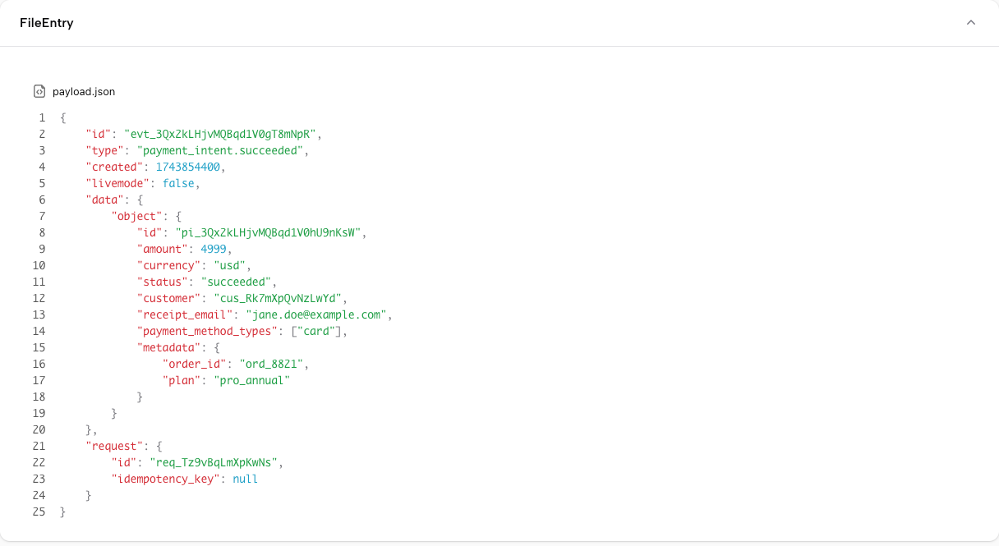
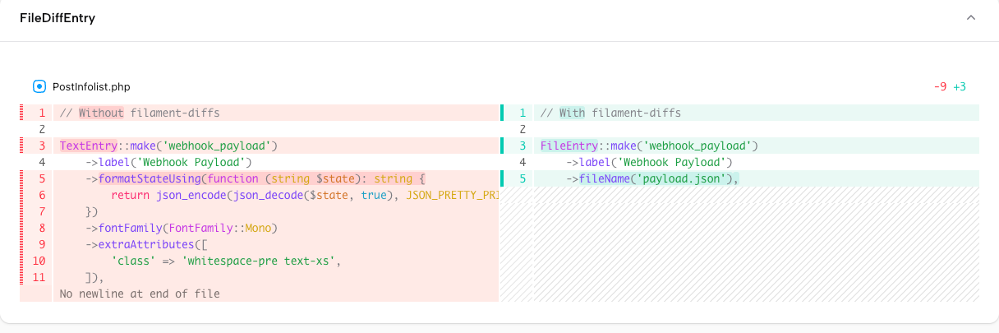

[](https://packagist.org/packages/kirschbaum-development/filament-diffs)
[](https://github.com/kirschbaum-development/filament-diffs/actions?query=workflow%3Arun-tests+branch%3Amain)
[](https://packagist.org/packages/kirschbaum-development/filament-diffs)

Syntax-highlighted file viewing and visual diff rendering for [Filament](https://filamentphp.com) infolists. Powered by [@pierre/diffs](https://diffs.com).

## Components

### FileEntry

Renders any text-based content with syntax highlighting. Useful for displaying raw file contents, stored code, API payloads, or any structured text directly in an infolist.

<picture>
  <source media="(prefers-color-scheme: dark)" srcset="art/file-entry-dark.png">
  <source media="(prefers-color-scheme: light)" srcset="art/file-entry-light.png">
  
</picture>

### FileDiffEntry

Renders a side-by-side diff between two versions of content with syntax highlighting. Useful for comparing model versions, reviewing changes, or showing before/after states.

<picture>
  <source media="(prefers-color-scheme: dark)" srcset="art/file-diff-entry-dark.png">
  <source media="(prefers-color-scheme: light)" srcset="art/file-diff-entry-light.png">
  
</picture>

## Requirements

- PHP 8.1+
- Filament 3.x, 4.x, or 5.x

## Installation

```bash
composer require kirschbaum-development/filament-diffs -W
```

Then register the plugin in your panel provider:

```php
use Kirschbaum\FilamentDiffs\FilamentDiffsPlugin;

public function panel(Panel $panel): Panel
{
    return $panel
        ->plugins([
            FilamentDiffsPlugin::make(),
        ]);
}
```

## Usage

### FileEntry

Use `FileEntry` in any [infolist](https://filamentphp.com/docs/5.x/infolists/overview) to render a field's value with syntax highlighting. The state is resolved from the record attribute matching the entry name:

```php
use Kirschbaum\FilamentDiffs\Infolists\Components\FileEntry;

FileEntry::make('webhook_payload')
    ->label('Webhook Payload')
    ->fileName('payload.json')
```

You can override the state entirely using a closure:

```php
FileEntry::make('webhook_payload')
    ->label('Webhook Payload')
    ->fileName('payload.json')
    ->state(fn ($record) => $record->getRawPayload())
```

### FileDiffEntry

Use `FileDiffEntry` to render a side-by-side diff between two strings. Both `->old()` and `->new()` accept a string or a closure that receives the current record. A `null` value is treated as an empty string, making it easy to represent newly created files.

```php
use Kirschbaum\FilamentDiffs\Infolists\Components\FileDiffEntry;

FileDiffEntry::make('content')
    ->label('Changes')
    ->fileName('post.md')
    ->old(fn ($record) => $record->previousVersion?->content)
    ->new(fn ($record) => $record->content)
```

### Setting the Language

Both components detect the syntax highlighting language from the file name. You can also set it explicitly using any [Shiki language identifier](https://shiki.style/languages) — this takes precedence over file name detection:

```php
FileEntry::make('source')
    ->language('php')

FileDiffEntry::make('content')
    ->old(fn ($record) => $record->previousVersion?->content)
    ->new(fn ($record) => $record->content)
    ->language('markdown')
```

### Passing Options

Both components accept an `->options()` array that is passed directly to the underlying [@pierre/diffs](https://diffs.com/docs) components, giving you access to the full range of configuration including themes, diff styles, and more:

```php
FileEntry::make('source')
    ->fileName('app.php')
    ->options([
        'theme' => 'github-dark',
    ])

FileDiffEntry::make('content')
    ->old(fn ($record) => $record->previousVersion?->content)
    ->new(fn ($record) => $record->content)
    ->fileName('post.md')
    ->options([
        'diffStyle' => 'unified',
    ])
```

See the [@pierre/diffs documentation](https://diffs.com/docs) for all available options.

## Configuration

### Default Theme

Publish the config file to set a default theme across all components in your application:

```bash
php artisan vendor:publish --tag="filament-diffs-config"
```

```php
// config/filament-diffs.php
return [
    'default_theme' => null,
];
```

You can also set a default theme per panel via the plugin, which takes precedence over the config file:

```php
FilamentDiffsPlugin::make()
    ->defaultTheme('github-dark')
```

### Theme Precedence

Themes are resolved in the following order (highest priority first):

1. Per-component `->options(['theme' => '...'])`
2. Panel plugin `FilamentDiffsPlugin::make()->defaultTheme('...')`
3. Config file `filament-diffs.default_theme`

## Testing

```bash
composer test
```

## Changelog

Please see [CHANGELOG](CHANGELOG.md) for more information on what has changed recently.

## Contributing

Please see [CONTRIBUTING](.github/CONTRIBUTING.md) for details.

## Security Vulnerabilities

Please review [our security policy](.github/SECURITY.md) on how to report security vulnerabilities.

## Credits

- [Travis Obregon](https://github.com/travisobregon)
- [Kirschbaum Development Group](https://kirschbaumdevelopment.com)
- [@pierre/diffs](https://diffs.com) by [The Pierre Computer Co.](https://github.com/pierrecomputer)
- [All Contributors](../../contributors)

## Sponsorship

Development of this package is sponsored by Kirschbaum Development Group, a developer driven company focused on problem solving, team building, and community. Learn more [about us](https://kirschbaumdevelopment.com?utm_source=github) or [join us](https://careers.kirschbaumdevelopment.com?utm_source=github)!

## License

The MIT License (MIT). Please see [License File](LICENSE.md) for more information.
